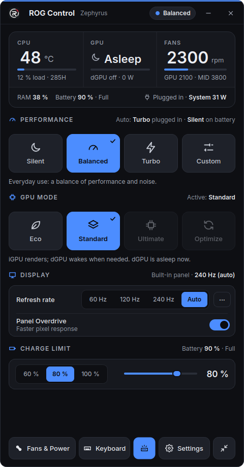
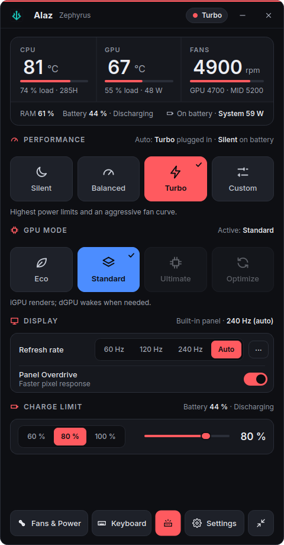
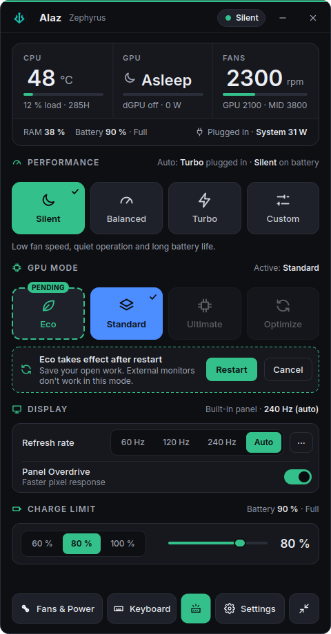
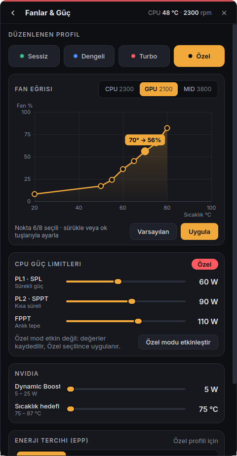
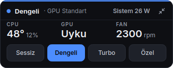
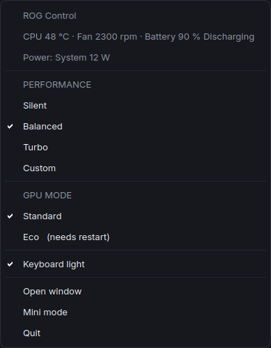
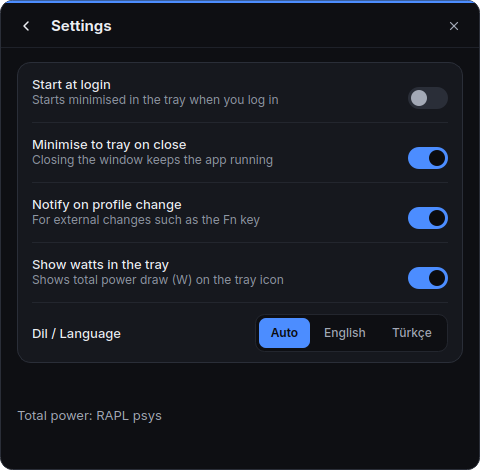

# ROG Control

A [G-Helper](https://github.com/seerge/g-helper)-inspired control centre for ASUS ROG laptops on Linux, built on top of `asusd` and `supergfxd`.

[](.github/workflows/tests.yml)
[](LICENSE)

English | [Türkçe](README.tr.md)

> **Status: early, tested on one machine.** Developed and verified on an ASUS ROG Zephyrus (2025) with Core Ultra 9 285H and RTX 5070 Laptop on Zorin OS 18 (GNOME, Wayland). Other models may behave differently. See [Safety and limitations](#8-safety-and-limitations).
>
> **The user interface is in Turkish.** Mode names are Sessiz / Dengeli / Turbo / Özel (Silent / Balanced / Turbo / Custom). Translations (i18n) are very welcome.

<p align="center">
  
  
</p>

## 1. Screenshots

| | |
|---|---|
|  Eco selected, applies at next boot |  Fan curve editor, power limits, NVIDIA, EPP |
|  Mini window |  Tray menu |
|  Keyboard brightness and colour |  Settings |

The screenshots are rendered with fake data (`tools/screenshot_windows.py`), so the model name and sensor values are placeholders.

## 2. Features

- **Performance modes:** Silent, Balanced, Turbo (asusd thermal policies) and **Custom** (an app-level mode: Turbo policy plus your own limits).
- **Custom power limits:** PL1 (SPL, 15 to 120 W), PL2 (SPPT, 15 to 150 W) and FPPT (15 to 170 W); defaults 60/90/110 W, applied only in Custom mode.
- **Fan curve editor:** 8 draggable points per fan (CPU, GPU, MID where present), per profile, with reset to defaults. Custom mode shares Turbo's fan curves.
- **NVIDIA Dynamic Boost and temperature target** sliders (asusd properties).
- **EPP** (energy performance preference) per profile.
- **AC/battery auto profile:** pick a profile to apply when plugged in and another on battery.
- **GPU modes:** Eco and Standard. Both are **boot-time and safe** (see [why](#4-why-this-exists-what-we-learned)). Ultimate (MUX) and Optimize are shown but not supported yet.
- **Refresh rate** of the internal panel only (never an external monitor), plus an Auto setting: highest rate on AC, 60 Hz on battery.
- **Panel Overdrive** toggle.
- **Battery charge limit** (20 to 100 %).
- **Keyboard** brightness and colour (Aura static colour).
- **Live sensors without waking the dGPU:** CPU/GPU temperature and load, fan RPM, RAM, battery.
- **Total system power** via the RAPL `psys` counter (watts on AC and battery).
- **Tray icon** with live watts, a profile and GPU-mode menu, and a compact **mini window**.
- Single instance, optional autostart (minimised to tray), optional notifications when the profile is changed externally (for example with the Fn key).

## 3. Requirements

- An ASUS ROG / TUF laptop supported by [`asusctl`](https://asus-linux.org). `asusd` (tested 6.0.12) and `supergfxd` (tested 5.2.7) must be installed and running.
- Python 3 with PyQt6 (including QtDBus) and `psutil`. Developed on Python 3.12 and PyQt6 6.6 / Qt 6.4; `pyproject.toml` declares Python 3.10 or newer, PyQt6 6.4 or newer.
  On Ubuntu-based distributions: `sudo apt install python3-pyqt6 python3-psutil`.
- GNOME on Wayland or X11 for the refresh-rate control (it uses Mutter's DisplayConfig D-Bus API, or `xrandr` on X11). Other compositors are untested.
- Optional: `polkit`/`pkexec` and the privileged helper (below) for GPU mode switching.

## 4. Why this exists: what we learned

Most existing tools assume you can switch the GPU live. On this hardware you cannot, and getting reliable Eco mode meant finding a chain of unrelated problems. This is the condensed result; every item is written up with commands and rollbacks in **[docs/SYSTEM_SETUP.md](docs/SYSTEM_SETUP.md)**. All of it was verified only on the reference machine above.

- **Live GPU switching breaks GNOME.** `supergfxctl -m` while the session runs killed gnome-shell and Xwayland when entering Eco, and froze Wayland gnome-shell when leaving it. So ROG Control **only changes the GPU mode at boot** and never calls the live switch.
- **Entering Eco:** set `"mode": "Integrated"` in `/etc/supergfxd.conf` and reboot.
- **Leaving Eco (the trick):** supergfxd refuses to leave Eco on its own (it forces Integrated again when it sees `dgpu_disable=1`). The working sequence is: stop supergfxd, set `/sys/bus/pci/drivers_autoprobe` to `0`, set the config mode to Hybrid, write `dgpu_disable=0`, **reboot**. The card comes back with no driver bound, so no new GPU appears while the desktop runs.
- **Plymouth made Eco entry racy.** The boot splash opened the NVIDIA DRM device (the only one present at about 4.5 s), so supergfxd's `rmmod nvidia` failed with "module in use" and Eco ended half-done. Removing `splash` from the kernel command line fixed it, at the price of a boot that is about 6.5 s longer.
- **Ubuntu's `gpu-manager` races supergfxd.** Both want to own GPU state; one boot ended in a deadlock inside `nv_pci_remove`. Mask `gpu-manager.service`.
- **`power-profiles-daemon` and `asusd` fight** over `platform_profile`. Mask power-profiles-daemon and let asusd own profiles.
- **Polling `nvidia-smi` keeps the dGPU awake.** The app only calls it when the device is already active and a real process holds `/dev/nvidiaN`. Compositors keep that node open permanently without waking the GPU, so they do not count.
- **Windows dual boot** can leave `dgpu_disable=1` (G-Helper's Eco). Set supergfxd `hotplug_type` to `Asus` so Linux adopts that state instead of fighting it.
- **Realtek card reader:** on this model ASPM produces PCIe AER error floods, so `pcie_aspm=off` is needed. Do not remove it on this model.
- **`GRUB_DEFAULT` by name**, not by index, so a changed menu cannot land on "UEFI Firmware Settings".

## 5. Tech stack and architecture

- **Python 3.12, PyQt6 (Qt 6.4).** The GUI thread never blocks: all D-Bus calls use QtDBus asynchronously; `subprocess` and slow I/O run in worker threads.
- **D-Bus APIs:** asusd (`org.asuslinux.Daemon`: Platform, FanCurves, Aura) and supergfxd (`org.supergfxctl.Daemon`, read-only; its `SetMode` and `SetConfig` are deliberately never called).
- **Sensors:** `psutil` plus sysfs/hwmon, RAPL via `powercap`.
- **Display:** Mutter `org.gnome.Mutter.DisplayConfig` over D-Bus, or `xrandr` on X11.
- **Privilege:** polkit + `pkexec` helper, used only for the boot-mode config and the Eco exit; a udev rule exposes only the RAPL `psys` counter.

```
rog_control/
├── app.py, __main__.py   entry point, single instance, tray, wiring
├── backend/              asusd.py, gfx.py, sensors.py, display.py, dbus_util.py, types.py
├── core/                 state.py (AppState: data + signals), controller.py (the only write path)
└── ui/                   theme.py, widgets/ (tiles, fan chart, cards, controls), windows/
helper/
├── rog-control-gfx-helper         root helper (stdlib only)
├── org.rogcontrol.gfx.policy      polkit action
├── 90-rog-control-rapl.rules      udev rule (RAPL psys only)
└── install.sh / uninstall.sh      privileged install, run with sudo
tests/                             pytest, offscreen Qt
tools/                             screenshot and widget gallery scripts
```

The windows read `AppState` and call `Controller`; they never talk to the backends directly. Every write is wrapped in busy/error reporting. See [docs/ARCHITECTURE.md](docs/ARCHITECTURE.md) for the module contracts (currently written in Turkish).

## 6. Install

### The app (no sudo)

```bash
git clone https://github.com/n3vrb/rog-control.git
cd rog-control
./install.sh
```

This installs the app under `~/.local/share/rog-control`, a launcher `~/.local/bin/rog-control`, a desktop entry and an icon. Make sure `~/.local/bin` is on your `PATH`.

### Start at login

```bash
./install.sh --autostart                  # installs and enables the systemd user service
journalctl --user -u rog-control -f       # logs
systemctl --user restart rog-control      # restart
systemctl --user disable --now rog-control   # turn off (or use the toggle in Settings)
```

The service starts the app minimised to the tray after login (it waits up to 20 s for the tray host). Add `--start` to also start it right away.

### First run

Start **ROG Control** from the application menu, or run `rog-control`. Performance modes, fan curves, power limits, display and keyboard controls work as soon as `asusd` is running. GPU mode switching and the total-power readout need the optional part below.

### Optional privileged helper (needs sudo)

```bash
sudo ./helper/install.sh
```

It installs three files:

| File | Purpose |
|---|---|
| `/usr/local/libexec/rog-control-gfx-helper` | root helper, run through `pkexec` |
| `/usr/share/polkit-1/actions/org.rogcontrol.gfx.policy` | polkit action (`auth_admin_keep`) |
| `/etc/udev/rules.d/90-rog-control-rapl.rules` | makes the RAPL `psys` counter readable |

**What the helper can do:** edit only the `"mode"` key of `/etc/supergfxd.conf` (Integrated or Hybrid), atomically with a backup; and, when leaving Eco, run the tested Eco-exit sequence (stop supergfxd, `drivers_autoprobe=0`, `dgpu_disable=0`). It refuses a symlinked config, validates all input, and refuses Eco when the MUX is set to dGPU direct.

**What it cannot / does not do:** it never calls `supergfxctl`, never reboots (the app asks you, then reboots through logind), and runs only one subprocess (`/usr/bin/systemctl stop supergfxd.service`, absolute path, clean environment, no shell).

**Security notes**

- Each GPU change asks for administrator authentication (`auth_admin_keep`: the authorisation is remembered for a short while).
- The udev rule makes `energy_uj` of the `psys` RAPL domain world-readable; package, core and DRAM domains are not touched. World-readable RAPL energy counters have been used in side-channel research (PLATYPUS); the exposure is limited to the platform counter, but if that concerns you, skip the helper's udev rule (delete it; the system-power reading will then be unavailable).

### Uninstall

```bash
./uninstall.sh                 # the app (settings kept)
sudo ./helper/uninstall.sh     # the optional privileged part, if installed
```

## 7. Recommended system setup

These make GPU switching and profiles reliable. All are optional, and **all boot-related changes are at your own risk**: a wrong GRUB or driver-loading change can produce a black screen. Keep a live USB at hand, and read the rollback before each step in **[docs/SYSTEM_SETUP.md](docs/SYSTEM_SETUP.md)**.

1. Align the NVIDIA kernel module and user-space versions (reboot after upgrades).
2. `/etc/supergfxd.conf`: `"hotplug_type": "Asus"`, `"always_reboot": true`.
3. `sudo systemctl mask power-profiles-daemon`
4. `sudo systemctl mask gpu-manager.service` (Ubuntu-based systems).
5. Remove `splash` from `GRUB_CMDLINE_LINUX_DEFAULT` (keep `quiet`), then `sudo update-grub`.
6. Dual boot: set `GRUB_DEFAULT` by entry name.
7. Keep `pcie_aspm=off` if your model needs it (it did on the reference machine).

The guide also lists what **not** to do: live `supergfxctl -m`, blacklisting NVIDIA autoload (four black-screen boots), and a supergfxd wait drop-in (adds 20 s to every boot).

## 8. Safety and limitations

- **Only one model tested.** Treat everything else as unverified. Bug reports from other models are valuable.
- **Leaving Eco requires an immediate reboot.** The dGPU is re-enabled right away with no driver bound, and `drivers_autoprobe` stays `0` until you reboot. The app prompts for the reboot.
- **Eco has no external display** on ports wired to the dGPU.
- **Removing `splash` costs about 6.5 s of boot time** on the reference machine.
- **Custom mode shares Turbo's fan curves** (it uses the Performance policy). Leaving Custom writes only the policy; whether the firmware then restores its own limits was not verified.
- **Ultimate (MUX) and Optimize GPU modes are not supported yet.**
- Idle draw on the reference machine is about 15 to 16 W on battery (measured; the RAPL `psys` reading is 1 to 2 W higher). `pcie_aspm=off` likely costs some of it but is required on this model (see above).
- `nvidia-powerd` was not installed on the reference machine, and Dynamic Boost depends on it; the effect of the Dynamic Boost slider there was not investigated.
- The interface is Turkish only.

## 9. Development

```bash
python3 -m venv .venv --system-site-packages   # or install PyQt6 and psutil in your own venv
QT_QPA_PLATFORM=offscreen python3 -m pytest tests
QT_QPA_PLATFORM=offscreen python3 tools/screenshot_windows.py docs/screenshots   # render windows with fake state
```

The suite has 262 tests (backends, core controller and state, widgets, windows, the root helper) and runs offscreen. **Tests never write to the real system**; write paths are exercised with mocks, fakes and a re-rooted helper (`ROG_CONTROL_HELPER_TESTROOT`, honoured only when not root).

Ground rules for contributions (from [docs/ARCHITECTURE.md](docs/ARCHITECTURE.md)): never block the GUI thread; never call `supergfxctl -m` or supergfxd `SetMode`/`SetConfig`; do not wake the dGPU for monitoring; unreadable values become `None` and show as an em dash, never an invented number; use `logging`, not `print`. Add or update tests with your change. Pull requests are welcome, especially: translations, other ROG models, Ultimate/MUX support, other desktop environments.

### How it was built

This project was designed and orchestrated with Anthropic's Claude: an orchestrator model split the work into waves, delegated each module to Claude Sonnet sub-agents under written contracts, and reviewed their output and tests. The human owner tested everything on real hardware and made the product decisions. The system findings in this README came from that real-hardware testing, not from guesswork.

## 10. Credits

- [asusctl / asusd and supergfxctl](https://asus-linux.org): the asus-linux.org project; ROG Control is only a front end for their daemons.
- [G-Helper](https://github.com/seerge/g-helper) by seerge, the inspiration for the feature set and the look.
- IBM Plex Sans, used as the design reference for the typography.

## License

GPL-3.0. See [LICENSE](LICENSE).
