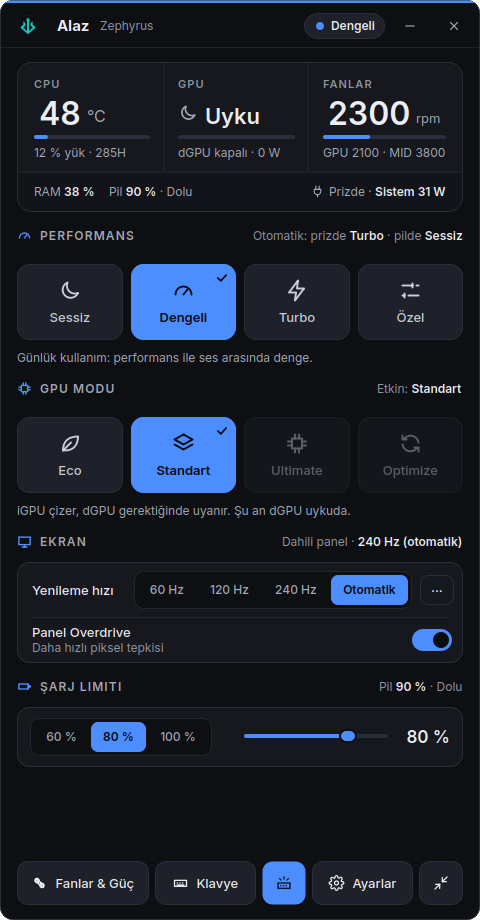
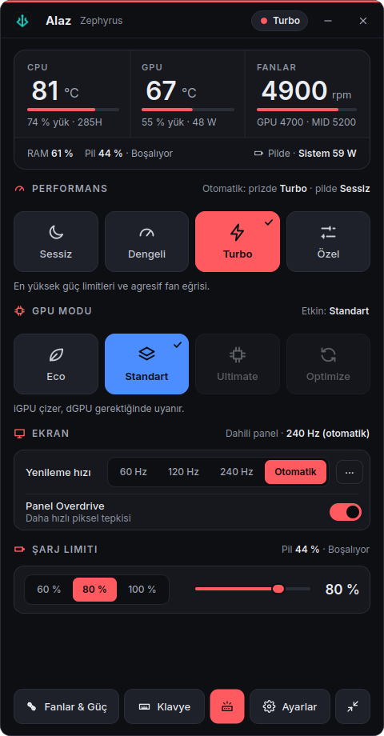
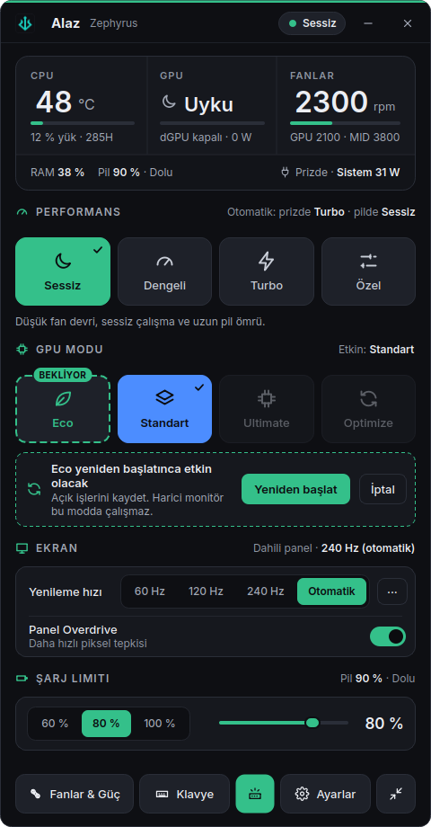
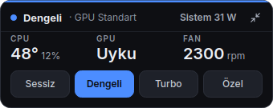
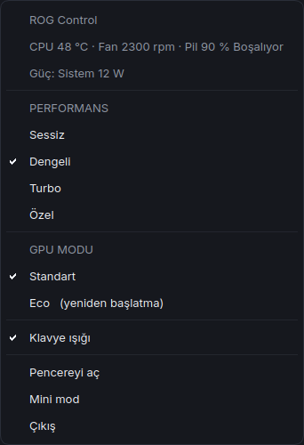
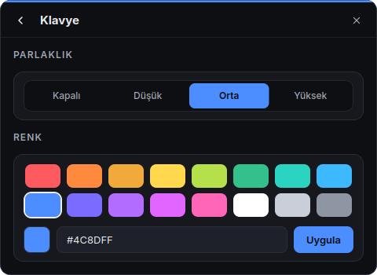
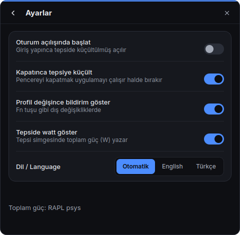

<p align="center"></p>

# Alaz

ASUS ROG dizüstü bilgisayarlar için Linux'ta çalışan, [G-Helper](https://github.com/seerge/g-helper)'dan esinlenmiş bir kontrol merkezi. `asusd` ve `supergfxd` üzerine kuruludur.

*Eski adı ROG Control.* Alaz, eski Türkçede "alev" demek. ASUS ile bağlantısı olmayan bağımsız bir projedir; ASUS ve ROG, ASUSTeK Computer Inc.'in ticari markalarıdır.

[](.github/workflows/tests.yml)
[](LICENSE)

[English](README.md) | Türkçe

> **Durum: erken aşamada, yalnızca tek makinede test edildi.** Core Ultra 9 285H ve RTX 5070 Laptop'lu bir ASUS ROG Zephyrus (2025) üzerinde, Zorin OS 18 (GNOME, Wayland) ile geliştirildi ve doğrulandı. Diğer modellerde davranış farklı olabilir. Bkz. [Güvenlik ve sınırlamalar](#8-güvenlik-ve-sınırlamalar).
>
> **Arayüz İngilizce ve Türkçe olarak sunulur.** Dil sistem yerel ayarına göre seçilir (`tr` ile başlıyorsa Türkçe, aksi halde İngilizce); Ayarlar → Dil bölümünden değiştirilebilir (yeniden başlatınca uygulanır). Yeni çeviriler memnuniyetle karşılanır: bkz. `alaz/i18n.py` ve `alaz/i18n_en.py`.

<p align="center">
  
  
</p>

## 1. Ekran görüntüleri

| | |
|---|---|
|  Eco seçili, bir sonraki açılışta uygulanır |  Fan eğrisi editörü, güç limitleri, NVIDIA, EPP |
|  Mini pencere |  Tepsi menüsü |
|  Klavye parlaklığı ve rengi |  Ayarlar |

Ekran görüntüleri sahte verilerle üretilmiştir (`tools/screenshot_windows.py`); model adı ve sensör değerleri örnektir.

## 2. Özellikler

- **Performans modları:** Sessiz, Dengeli, Turbo (asusd termal politikaları) ve **Özel** (uygulama düzeyinde bir mod: Turbo politikası artı kendi limitlerin).
- **Özel güç limitleri:** PL1 (SPL, 15–120 W), PL2 (SPPT, 15–150 W) ve FPPT (15–170 W); varsayılanlar 60/90/110 W. Yalnızca Özel modda uygulanır.
- **Fan eğrisi editörü:** Her fan için (CPU, GPU, varsa MID), profil başına 8 sürüklenebilir nokta; varsayılana sıfırlama. Özel mod, Turbo'nun fan eğrilerini paylaşır.
- **NVIDIA Dynamic Boost ve sıcaklık hedefi** kaydırıcıları (asusd özellikleri).
- Profil başına **EPP** (enerji/performans tercihi).
- **Prize takılı / pil için otomatik profil:** Prizdeyken bir profil, pildeyken başka bir profil uygulanır.
- **GPU modları:** Eco ve Standart. İkisi de **yalnızca açılışta uygulanır ve güvenlidir** ([nedeni](#4-bu-proje-neden-var-neler-öğrendik)). Ultimate (MUX) ve Optimize gösterilir ama henüz desteklenmez.
- Yalnızca **dahili panelin** yenileme hızı (harici monitöre dokunmaz) ve Otomatik seçeneği: prizde en yüksek hız, pilde 60 Hz.
- **Panel Overdrive** anahtarı.
- **Şarj limiti** (%20–%100).
- **Klavye** parlaklığı ve rengi (Aura sabit renk).
- **dGPU'yu uyandırmayan canlı sensörler:** CPU/GPU sıcaklığı ve yükü, fan devri, RAM, pil.
- RAPL `psys` sayacıyla **toplam sistem gücü** (prizde ve pilde watt).
- Anlık watt gösteren **tepsi simgesi**, profil ve GPU modu menüsü, kompakt **mini pencere**.
- Tek örnek çalışır; isteğe bağlı oturumda otomatik başlatma (tepside küçültülmüş) ve profil dışarıdan değişince (örneğin Fn tuşu) isteğe bağlı bildirim.

## 3. Gereksinimler

- [`asusctl`](https://asus-linux.org) tarafından desteklenen bir ASUS ROG / TUF dizüstü. `asusd` (test edilen: 6.0.12) ve `supergfxd` (test edilen: 5.2.7) kurulu ve çalışır durumda olmalı.
- PyQt6 (QtDBus dahil) ve `psutil` ile Python 3. Python 3.12 ve PyQt6 6.6 / Qt 6.4 ile geliştirildi; `pyproject.toml` Python 3.10+ ve PyQt6 6.4+ bildirir.
  Ubuntu tabanlı dağıtımlarda: `sudo apt install python3-pyqt6 python3-psutil`.
- Yenileme hızı kontrolü için GNOME (Wayland veya X11): Mutter'ın DisplayConfig D-Bus API'sini, X11'de `xrandr`'ı kullanır. Diğer ortamlar test edilmedi.
- İsteğe bağlı: GPU modu geçişi için `polkit`/`pkexec` ve aşağıdaki ayrıcalıklı yardımcı.

## 4. Bu proje neden var: neler öğrendik

Mevcut araçların çoğu GPU'yu canlı değiştirebileceğini varsayar. Bu donanımda değiştiremezsin; güvenilir bir Eco modu için birbiriyle ilgisiz bir dizi sorunu bulmak gerekti. Aşağıdaki özetin her maddesi komutlar ve geri alma adımlarıyla **[docs/SYSTEM_SETUP.md](docs/SYSTEM_SETUP.md)** dosyasında anlatılıyor (İngilizce). Hepsi yalnızca yukarıdaki referans makinede doğrulandı.

- **Canlı GPU geçişi GNOME'u bozar.** Oturum açıkken `supergfxctl -m`, Eco'ya girerken gnome-shell ve Xwayland'i öldürdü, Eco'dan çıkarken Wayland gnome-shell'i dondurdu. Bu yüzden Alaz GPU modunu **yalnızca açılışta** değiştirir, canlı geçişi hiç çağırmaz.
- **Eco'ya giriş:** `/etc/supergfxd.conf` içinde `"mode": "Integrated"` yap ve yeniden başlat.
- **Eco'dan çıkış (hile):** supergfxd Eco'dan kendiliğinden çıkmaz (`dgpu_disable=1` görünce modu yine Integrated'a zorlar). Çalışan sıra: supergfxd'yi durdur, `/sys/bus/pci/drivers_autoprobe` değerini `0` yap, yapılandırmada modu Hybrid yap, `dgpu_disable=0` yaz, **yeniden başlat**. Kart sürücüsüz geri gelir; masaüstü çalışırken yeni bir GPU belirmez.
- **Plymouth, Eco girişini şansa bağladı.** Açılış logosu, o an mevcut tek DRM aygıtı olan NVIDIA'yı (~4,5. saniye) açıyordu; supergfxd'nin `rmmod nvidia` komutu "module in use" ile başarısız oldu ve Eco yarım kaldı. Çekirdek satırından `splash` kaldırmak sorunu çözdü; bedeli yaklaşık 6,5 sn daha uzun açılış.
- **Ubuntu'nun `gpu-manager`'ı supergfxd ile yarışır.** İkisi de GPU durumunu yönetmek ister; bir açılış `nv_pci_remove` içinde kilitlenmeyle bitti. `gpu-manager.service` maskelenmeli.
- **`power-profiles-daemon` ve `asusd` çatışır:** ikisi de `platform_profile` yazar. power-profiles-daemon maskelenip profilleri asusd'ye bırakmak gerekir.
- **`nvidia-smi` yoklamak dGPU'yu uyanık tutar.** Uygulama onu yalnızca aygıt zaten aktifken ve `/dev/nvidiaN`'i gerçekten tutan bir süreç varken çağırır. Kompozitörler bu düğümü GPU'yu uyandırmadan sürekli açık tuttuğu için sayılmaz.
- **Windows ile çift önyükleme**, `dgpu_disable=1` bırakabilir (G-Helper'ın Eco'su). supergfxd `hotplug_type` değerini `Asus` yap; Linux bu durumla savaşmak yerine onu benimser.
- **Realtek kart okuyucu:** bu modelde ASPM, PCIe AER hata yağmuruna yol açıyor; bu yüzden `pcie_aspm=off` gerekli. Bu modelde kaldırma.
- **`GRUB_DEFAULT` sıra numarasıyla değil isimle** verilmeli; böylece menü değişince "UEFI Firmware Settings" satırına düşmez.

## 5. Teknoloji ve mimari

- **Python 3.12, PyQt6 (Qt 6.4).** GUI thread'i asla bloklanmaz: tüm D-Bus çağrıları QtDBus ile asenkrondur; `subprocess` ve yavaş G/Ç worker thread'lerde çalışır.
- **D-Bus API'leri:** asusd (`org.asuslinux.Daemon`: Platform, FanCurves, Aura) ve supergfxd (`org.supergfxctl.Daemon`, yalnızca okuma; `SetMode` ve `SetConfig` bilerek hiç çağrılmaz).
- **Sensörler:** `psutil` ile sysfs/hwmon, RAPL için `powercap`.
- **Ekran:** D-Bus üzerinden Mutter `org.gnome.Mutter.DisplayConfig`, X11'de `xrandr`.
- **Yetki:** polkit + `pkexec` yardımcısı, yalnızca açılış modu yapılandırması ve Eco çıkışı için; bir udev kuralı yalnızca RAPL `psys` sayacını açar.

```
alaz/
├── app.py, __main__.py   giriş noktası, tek örnek, tepsi, bağlantılar
├── backend/              asusd.py, gfx.py, sensors.py, display.py, dbus_util.py, types.py
├── core/                 state.py (AppState: veri + sinyaller), controller.py (tek yazma yolu)
└── ui/                   theme.py, widgets/ (kutucuklar, fan grafiği, kartlar, kontroller), windows/
helper/
├── alaz-gfx-helper         root yardımcı (yalnızca standart kütüphane)
├── org.alaz.gfx.policy      polkit eylemi
├── 90-alaz-rapl.rules      udev kuralı (yalnızca RAPL psys)
└── install.sh / uninstall.sh      ayrıcalıklı kurulum, sudo ile çalışır
tests/                             pytest, ekransız (offscreen) Qt
tools/                             ekran görüntüsü ve widget galeri betikleri
```

Pencereler `AppState`'i okur ve `Controller`'ı çağırır; backend'lerle doğrudan konuşmaz. Her yazma işlemi meşgul/hata raporlamasıyla sarılıdır. Modül sözleşmeleri için [docs/ARCHITECTURE.md](docs/ARCHITECTURE.md) dosyasına bak (Türkçe).

## 6. Kurulum

### Uygulama (sudo gerekmez)

```bash
git clone https://github.com/n3vrb/alaz.git
cd alaz
./install.sh
```

Uygulamayı `~/.local/share/alaz` altına, başlatıcıyı `~/.local/bin/alaz` olarak, bir masaüstü girdisi ve bir simge ile birlikte kurar. `~/.local/bin` dizininin `PATH` içinde olduğundan emin ol.

### Oturum açılışında başlatma

```bash
./install.sh --autostart                  # systemd kullanıcı servisini kurar ve etkinleştirir
journalctl --user -u alaz -f       # günlükler
systemctl --user restart alaz      # yeniden başlat
systemctl --user disable --now alaz   # kapat (veya Ayarlar'daki anahtar)
```

Servis, oturum açılınca uygulamayı tepside küçültülmüş başlatır (tepsi hazır olana kadar en fazla 20 sn bekler). Hemen başlatmak için `--start` ekle.

### İlk çalıştırma

Uygulama menüsünden **Alaz**'ü aç ya da `alaz` komutunu çalıştır. Performans modları, fan eğrileri, güç limitleri, ekran ve klavye kontrolleri `asusd` çalışır çalışmaz kullanılabilir. GPU modu geçişi ve toplam güç göstergesi için aşağıdaki isteğe bağlı bölüm gerekir.

### İsteğe bağlı ayrıcalıklı yardımcı (sudo gerekir)

```bash
sudo ./helper/install.sh
```

Üç dosya kurar:

| Dosya | Amaç |
|---|---|
| `/usr/local/libexec/alaz-gfx-helper` | `pkexec` ile çalışan root yardımcı |
| `/usr/share/polkit-1/actions/org.alaz.gfx.policy` | polkit eylemi (`auth_admin_keep`) |
| `/etc/udev/rules.d/90-alaz-rapl.rules` | RAPL `psys` sayacını okunabilir yapar |

**Yardımcının yapabildikleri:** yalnızca `/etc/supergfxd.conf` içindeki `"mode"` anahtarını (Integrated veya Hybrid) yedek alarak ve atomik biçimde değiştirir; Eco'dan çıkarken test edilmiş Eco çıkış sırasını (supergfxd'yi durdur, `drivers_autoprobe=0`, `dgpu_disable=0`) çalıştırır. Symlink olan yapılandırmayı reddeder, tüm girdiyi doğrular ve MUX doğrudan dGPU'ya ayarlıyken Eco'yu reddeder.

**Yapmadıkları:** `supergfxctl`'yi asla çağırmaz, yeniden başlatmaz (uygulama sana sorar, sonra logind üzerinden yeniden başlatır) ve yalnızca tek bir alt süreç çalıştırır (`/usr/bin/systemctl stop supergfxd.service`; mutlak yol, temiz ortam, kabuk yok).

**Güvenlik notları**

- Her GPU değişikliği yönetici kimlik doğrulaması ister (`auth_admin_keep`: yetki kısa bir süre hatırlanır).
- udev kuralı, `psys` RAPL alanının `energy_uj` dosyasını herkes tarafından okunabilir yapar; paket, çekirdek ve DRAM alanlarına dokunulmaz. Herkesçe okunabilir RAPL enerji sayaçları yan kanal araştırmalarında (PLATYPUS) kullanılmıştır; burada maruziyet yalnızca platform sayacıyla sınırlıdır, ama bu seni rahatsız ediyorsa udev kuralını silebilirsin (sistem gücü göstergesi o zaman kullanılamaz).

### Kaldırma

```bash
./uninstall.sh                 # uygulama (ayarlar korunur)
sudo ./helper/uninstall.sh     # kurulduysa isteğe bağlı ayrıcalıklı kısım
```

## 7. Önerilen sistem ayarları

Bunlar GPU geçişini ve profilleri güvenilir kılar. Hepsi isteğe bağlıdır ve **açılışla ilgili her değişiklik kendi sorumluluğundadır**: yanlış bir GRUB ya da sürücü yükleme değişikliği siyah ekrana yol açabilir. Yanında bir canlı USB bulundur ve her adımdan önce **[docs/SYSTEM_SETUP.md](docs/SYSTEM_SETUP.md)** içindeki geri alma adımını oku.

1. NVIDIA çekirdek modülü ile kullanıcı alanı sürümlerini eşitle (güncellemeden sonra yeniden başlat).
2. `/etc/supergfxd.conf`: `"hotplug_type": "Asus"`, `"always_reboot": true`.
3. `sudo systemctl mask power-profiles-daemon`
4. `sudo systemctl mask gpu-manager.service` (Ubuntu tabanlı sistemler).
5. `GRUB_CMDLINE_LINUX_DEFAULT` içinden `splash`'ı kaldır (`quiet` kalsın), sonra `sudo update-grub`.
6. Çift önyükleme: `GRUB_DEFAULT` değerini girdi adıyla ver.
7. Modelin gerektiriyorsa `pcie_aspm=off` kalsın (referans makinede gerekiyordu).

Rehberde ayrıca **yapılmaması** gerekenler de var: canlı `supergfxctl -m`, NVIDIA otomatik yüklemesini kara listeye almak (dört siyah ekranlı açılış) ve supergfxd bekleme drop-in'i (her açılışa 20 sn ekler).

## 8. Güvenlik ve sınırlamalar

- **Yalnızca tek model test edildi.** Diğer her şey doğrulanmamıştır. Başka modellerden hata raporları çok değerlidir.
- **Eco'dan çıkış hemen yeniden başlatma gerektirir.** dGPU sürücüsüz olarak hemen yeniden etkinleştirilir ve `drivers_autoprobe` yeniden başlatana kadar `0` kalır. Uygulama yeniden başlatmayı sorar.
- **Eco'da, dGPU'ya bağlı portlarda harici ekran çalışmaz.**
- **`splash`'ı kaldırmak** referans makinede açılışı yaklaşık 6,5 sn uzatır.
- **Özel mod, Turbo'nun fan eğrilerini paylaşır** (Performance politikasını kullanır). Özel'den çıkınca yalnızca politika yazılır; donanım yazılımının kendi limitlerine dönüp dönmediği doğrulanmadı.
- **Ultimate (MUX) ve Optimize GPU modları henüz desteklenmiyor.**
- Referans makinede boşta tüketim pilde yaklaşık 15–16 W (ölçüldü; RAPL `psys` değeri 1–2 W daha yüksek gösteriyor). `pcie_aspm=off` muhtemelen bunun bir kısmına mal oluyor ama bu modelde gerekli (yukarıya bakın).
- Referans makinede `nvidia-powerd` kurulu değildi ve Dynamic Boost ona bağlı; oradaki kaydırıcının etkisi incelenmedi.
- Arayüz yalnızca İngilizce ve Türkçedir (Ayarlar → Dil; diğer diller katkı olarak memnuniyetle karşılanır).

## 9. Geliştirme

```bash
python3 -m venv .venv --system-site-packages   # ya da PyQt6 ve psutil'i kendi venv'ine kur
QT_QPA_PLATFORM=offscreen python3 -m pytest tests
QT_QPA_PLATFORM=offscreen python3 tools/screenshot_windows.py docs/screenshots/tr --lang tr   # pencereleri sahte durumla çiz
```

Test takımında 262 test var (backend'ler, core controller ve state, widget'lar, pencereler, root yardımcı) ve ekransız çalışır. **Testler gerçek sisteme asla yazmaz**; yazma yolları mock, sahte nesneler ve yeniden köklendirilmiş yardımcıyla (`ALAZ_HELPER_TESTROOT`, yalnızca root değilken geçerli) sınanır.

Katkı kuralları ([docs/ARCHITECTURE.md](docs/ARCHITECTURE.md) kaynaklı): GUI thread'ini asla bloklama; `supergfxctl -m` ya da supergfxd `SetMode`/`SetConfig` çağırma; izleme için dGPU'yu uyandırma; okunamayan değer `None` olur ve uydurma sayı yerine tire olarak görünür; `print` yerine `logging` kullan. Değişikliğinle birlikte test ekle ya da güncelle. Pull request'ler memnuniyetle karşılanır; özellikle: çeviriler, diğer ROG modelleri, Ultimate/MUX desteği, diğer masaüstü ortamları.

### Nasıl yapıldı

Bu proje Anthropic'in Claude'u ile tasarlandı ve yönetildi: bir orkestratör model işi dalgalara böldü, her modülü yazılı sözleşmelerle Claude Sonnet alt ajanlarına devretti, çıktılarını ve testlerini gözden geçirdi. Proje sahibi her şeyi gerçek donanımda test etti ve ürün kararlarını verdi. Bu README'deki sistem bulguları tahminlerden değil, o gerçek donanım testlerinden geldi.

## 10. Teşekkürler

- [asusctl / asusd ve supergfxctl](https://asus-linux.org): asus-linux.org projesi; Alaz yalnızca onların servislerine bir ön yüzdür.
- Özellik setine ve görünüme ilham veren [G-Helper](https://github.com/seerge/g-helper) (seerge).
- Tipografi için tasarım referansı olarak IBM Plex Sans.

## Lisans

GPL-3.0. Bkz. [LICENSE](LICENSE).
